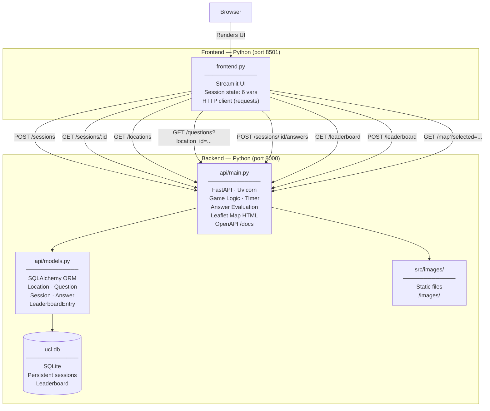

# UCL Guessr

> A timed campus trivia game with a FastAPI/SQLite backend and a Streamlit frontend as a pure display layer.

[](https://python.org)
[](https://fastapi.tiangolo.com)
[](https://streamlit.io)
[](https://www.sqlalchemy.org)
[](https://www.ucl.ac.uk)

---

## Overview

UCL Guessr is a **timed, location-based trivia game** covering 10 iconic UCL campus buildings. Players explore an interactive Leaflet.js map, select buildings, and answer multiple-choice questions — all within a 90-second server-authoritative countdown. Scores persist to SQLite and rank on a live leaderboard.

Commissioned for **UCL's 200th anniversary (1826–2026)** and targeted at incoming first-year students during orientation week.

**What this project demonstrates:**

- REST API design with OpenAPI/Swagger docs (FastAPI auto-generates at `/docs`)
- Relational DB schema design with SQLAlchemy ORM (5 tables, FK relationships)
- Server-authoritative game logic — timer and answer evaluation never touch the client
- Secure answer handling — correct answers are stored server-side and never returned to the frontend
- Persistent leaderboard with ranked scoring across sessions
- Server-rendered interactive map (Leaflet.js HTML) embedded in a Python UI via `components.html()`

---

## Architecture



**Data flow:** Every Streamlit rerun calls `GET /sessions/:id` to fetch authoritative game state (score, timer, answered list, `is_over`). The frontend holds no game logic — it renders what the API tells it.

---

## API Reference

Full interactive docs at **`http://localhost:8000/docs`** (Swagger UI, auto-generated by FastAPI).

| Method | Endpoint | Description |
|--------|----------|-------------|
| `GET` | `/health` | Health check → `{ status, db, timestamp }` |
| `GET` | `/locations` | All 10 buildings → `[{ id, key, lat, lng, img_path }]` |
| `GET` | `/locations/{id}` | Single location + embedded question (shuffled options) |
| `GET` | `/questions?location_id={id}` | Question + 4 shuffled options — correct answer omitted |
| `GET` | `/questions/{id}` | Same, by question ID |
| `POST` | `/sessions` | Create game session → `{ session_id, total, created_at }` |
| `GET` | `/sessions/{id}` | Game state → `{ remaining_seconds, score, total, answered_location_ids, is_over, is_started }` |
| `POST` | `/sessions/{id}/answers` | Submit answer → `{ correct, correct_answer, score, is_over }` |
| `GET` | `/sessions/{id}/stats` | Session analytics → `{ accuracy_pct, time_elapsed_seconds, questions_answered, ... }` |
| `GET` | `/leaderboard?limit=10` | Top scores ranked by score desc, time asc |
| `POST` | `/leaderboard` | Submit score with player name — validates session is finished |
| `GET` | `/map?selected={key}` | Full Leaflet.js HTML — all 10 markers, selected pin highlighted |

---

## Database Schema

```
locations      questions          sessions          answers            leaderboard
──────────     ──────────         ──────────        ──────────         ──────────
id PK          id PK              id PK (UUID)      id PK              id PK
key (unique)   location_id FK ──► key               session_id FK ──►  player_name
lat            text               created_at         location_id FK     session_id FK
lng            option_a           started_at (null)  answer_given       score
img_path       option_b           is_over            is_correct         total
               option_c                              answered_at        completed_at
               correct_answer
```

`started_at` is `NULL` until the first answer is submitted — the 90-second clock only starts then.

---

## Key Engineering Decisions

| Decision | Rationale |
|---|---|
| **FastAPI over Flask/Django** | Auto-generates OpenAPI/Swagger docs, Pydantic v2 request validation, and async-ready — all with minimal boilerplate. |
| **SQLAlchemy ORM + SQLite** | Portable, zero-config persistence. ORM models serve as both DB schema and documentation. Trivially swappable to Postgres via `DATABASE_URL`. |
| **Server-authoritative timer** | `remaining_seconds = max(0, 90 - elapsed)` computed fresh on every `GET /sessions/:id`. Timer cannot drift or be spoofed from the client. |
| **Timer starts on first answer** | `session.started_at` is set on the first `POST /sessions/:id/answers`, not at session creation — players get time to orient on the map before the clock runs. |
| **Answer security** | `correct_answer` is stored in the `questions` table only. `GET /questions` returns shuffled distractors; evaluation is server-side on submission. The correct answer is never in any response schema except `AnswerResponse` (after submission). |
| **`random.sample` shuffle** | Python stdlib `random.sample(options, 4)` gives uniform distribution over 4! orderings — no external dependency needed. |
| **Server-rendered Leaflet map** | `GET /map` returns a complete Leaflet.js HTML document, dynamically injecting geo-coordinates, selected-pin state, and building photo popups from the DB. Streamlit embeds it via `components.html()`. |
| **UUID session IDs** | `uuid4()` from stdlib. Each Play Again creates a fresh DB row — no session cleanup needed, full history preserved. |
| **Leaderboard duplicate guard** | `POST /leaderboard` checks for an existing entry with the same `session_id` before inserting, preventing double-submission on refresh. |
| **Lifespan-based DB seed** | FastAPI `lifespan` context manager runs `seed()` on startup. `seed()` is idempotent — checks row count before inserting. No migration tooling required for a fixed dataset. |

---

## Screenshots

> **Recommended screenshots to capture and add here:**
>
> 1. **Splash Screen** — full-screen purple gradient overlay with spinning loader.
> 2. **Active Game View** — two-column layout: Leaflet map left, trivia Q&A right, live timer header.
> 3. **Game Over Screen** — score card, name input, leaderboard submission, Top 5 table.
> 4. **Swagger UI** — `http://localhost:8000/docs` showing all 12 endpoints.

<!-- Uncomment and replace with actual paths once screenshots are captured:


-->

---

## Tech Stack

| Layer | Technology |
|---|---|
| Frontend | [Streamlit](https://streamlit.io) — reactive Python UI, HTTP via `requests`, Leaflet map via `components.html()` |
| API | [FastAPI](https://fastapi.tiangolo.com) + [Uvicorn](https://www.uvicorn.org) — REST API, game logic, OpenAPI docs, static file serving |
| ORM | [SQLAlchemy](https://www.sqlalchemy.org) — declarative models, FK relationships, session management |
| Database | SQLite (`ucl.db`) — persistent sessions, answers, leaderboard |
| Mapping | [Leaflet.js](https://leafletjs.com) + [OpenStreetMap](https://www.openstreetmap.org) — interactive markers with photo popups |
| Validation | [Pydantic v2](https://docs.pydantic.dev) — request/response schemas, auto-serialisation |
| Runtime | Python 3.11 |

---

## Quick Start

```bash
# 1. Clone
git clone https://github.com/<your-username>/ucl-200.git
cd ucl-200

# 2. Install dependencies
python3 -m venv venv && source venv/bin/activate
pip install -r requirements.txt

# 3. Start the API (seeds DB automatically on first run)
uvicorn api.main:app --reload --port 8000
# → API:       http://localhost:8000
# → Swagger:   http://localhost:8000/docs

# 4. Start the frontend (new terminal, same venv)
streamlit run frontend.py
# → App: http://localhost:8501
```

---

## Project Structure

```
ucl-200/
├── frontend.py              # Streamlit client — UI only, no game logic
├── requirements.txt         # Python dependencies
├── ucl.db                   # SQLite database (auto-created on first run)
├── api/
│   ├── main.py              # FastAPI app — CORS, static files, health, map endpoint
│   ├── database.py          # SQLAlchemy engine + session factory
│   ├── models.py            # ORM models: Location, Question, Session, Answer, LeaderboardEntry
│   ├── schemas.py           # Pydantic v2 request/response schemas
│   ├── seed.py              # Idempotent DB seed — runs on startup via lifespan
│   ├── data/
│   │   └── locations.py     # 10 UCL locations: keys, lat/lng, trivia Q&A
│   └── routers/
│       ├── locations.py     # GET /locations, GET /locations/{id}
│       ├── questions.py     # GET /questions, GET /questions/{id}
│       ├── sessions.py      # POST /sessions, GET /sessions/{id}, POST answers, GET stats
│       └── leaderboard.py   # GET /leaderboard, POST /leaderboard
├── src/
│   └── images/              # Building photographs served as static files at /images/*
└── backend/                 # Deprecated — original Node.js/Express backend (kept for git history)
```

---

*Python · FastAPI · SQLAlchemy · Streamlit · Leaflet.js · Built for UCL's 200th Anniversary*
