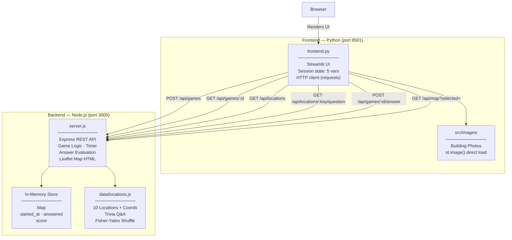

# UCL Guessr

> A timed campus trivia game built on a client/server architecture — Node.js/Express backend handling all game logic, with a Streamlit frontend as a pure display layer.

[](https://python.org)
[](https://streamlit.io)
[](https://nodejs.org)
[](https://www.ucl.ac.uk)

---

## Overview

UCL Guessr is a **timed, location-based trivia game** covering 10 iconic UCL campus buildings. Players explore an interactive map, select buildings, and answer multiple-choice questions — all within a 90-second server-authoritative countdown.

Commissioned for **UCL's 200th anniversary (1826–2026)** and targeted at incoming first-year students during orientation week.

**What this project demonstrates:**

- Designing a REST API with clean separation between game logic and UI
- Server-side state management and timer authority to prevent client manipulation
- Secure answer handling — correct answers never leave the backend
- Embedding a dynamically generated interactive map (Leaflet.js) within a Python UI
- Reactive frontend architecture with minimal client-side state (4 session variables)

---

## Architecture



**Data flow:** Every Streamlit rerun calls `GET /api/games/:id` to fetch authoritative game state (score, timer, answered list, `is_over`). The frontend holds no game logic — it renders what the API tells it.

The interactive map is entirely server-rendered: `GET /api/map` returns a full Leaflet.js HTML document with geo-located markers for all 10 buildings, embedded in Streamlit via `components.html()`.

---

## API Reference

| Method | Endpoint | Description |
|--------|----------|-------------|
| `POST` | `/api/games` | Create session → `{ session_id }` |
| `GET` | `/api/games/:id` | Game state → `{ remaining_seconds, score, total, answered_locations, is_over, is_started }` |
| `GET` | `/api/locations` | All buildings → `[{ key, img_path }]` |
| `GET` | `/api/locations/:key/question` | Question + shuffled options (correct answer omitted) |
| `POST` | `/api/games/:id/answer` | Submit answer → `{ correct, correct_answer, score, is_over }` |
| `GET` | `/api/map?selected=<key>` | Full Leaflet.js HTML — all 10 building markers, selected pin highlighted |

---

## Key Engineering Decisions

| Decision | Rationale |
|---|---|
| **Server-authoritative timer** | `remaining_seconds = max(0, 90 - (Date.now() - started_at) / 1000)` computed fresh on every `GET /api/games/:id` call. Timer cannot drift or be spoofed from the client. |
| **Timer starts on first answer** | `session.started_at` is set on the first `POST /api/games/:id/answer`, not at session creation — giving players time to orient before the clock runs. |
| **Answer security** | Correct answers are never sent to the frontend. `GET /api/locations/:key/question` returns shuffled distractors only; evaluation happens server-side on submission. |
| **Fisher-Yates shuffle** | Options are shuffled server-side on each question fetch using Fisher-Yates, ensuring uniform distribution across 4! possible orderings. |
| **Server-rendered Leaflet map** | The backend generates complete Leaflet.js HTML dynamically, injecting geo-coordinates, selected-pin state, and building photo popups. Streamlit embeds it via `components.html()` — no JS build step required in the frontend. |
| **UUID session management** | Each game is a UUID-keyed in-memory session. `POST /api/games` creates a new one for Play Again without a page reload — clean state reset with a single API call. |
| **Minimal frontend state** | Streamlit session state holds exactly 5 variables: `session_id`, `selected_location`, `show_splash`, `splash_start_time`, `current_question`. No game logic lives in Python. |
| **Question caching across reruns** | `current_question` is cached in session state so options don't reshuffle on every Streamlit rerun — answers stay stable while the user is deciding. |

---

## Screenshots

> **Recommended screenshots to capture and add here:**
>
> 1. **Splash Screen** — full-screen purple gradient overlay with spinning loader, captured within the first 2 seconds of launch.
> 2. **Active Game View** — two-column layout: interactive Leaflet map on the left, trivia question + 4 answer buttons on the right, live timer in the header.
> 3. **Game Over Score Card** — centred gradient result modal showing final score and Play Again button.

<!-- Uncomment and replace with actual paths once screenshots are captured:


-->

---

## Tech Stack

| Layer | Technology |
|---|---|
| Frontend | [Streamlit](https://streamlit.io) — reactive Python UI, HTTP client via `requests`, Leaflet map via `components.html()` |
| Backend | [Node.js](https://nodejs.org) + [Express](https://expressjs.com) — REST API, game logic, server-rendered map HTML |
| Mapping | [Leaflet.js](https://leafletjs.com) + [OpenStreetMap](https://www.openstreetmap.org) — interactive geo markers with building photo popups |
| Session IDs | [`uuid`](https://www.npmjs.com/package/uuid) — RFC 4122 v4 UUIDs |
| Runtime | Python 3.11 · Node.js 18+ |

---

## Quick Start

```bash
# 1. Clone
git clone https://github.com/<your-username>/ucl-200.git
cd ucl-200

# 2. Backend
cd backend && npm install
node server.js          # runs on http://localhost:3000

# 3. Frontend (new terminal)
cd ..
python3 -m venv venv && source venv/bin/activate
pip install -r requirements.txt
streamlit run frontend.py   # runs on http://localhost:8501
```

---

## Project Structure

```
ucl-200/
├── frontend.py              # Streamlit client — UI only, no game logic
├── requirements.txt         # Python: streamlit, requests
├── backend/
│   ├── package.json         # Node.js dependencies
│   ├── server.js            # Express app — all routes, game logic, map HTML generation
│   └── data/
│       └── locations.js     # 10 UCL locations: keys, lat/lng coords, trivia Q&A
└── src/
    └── images/              # Building photographs (JPEG/PNG), served via Express static
        ├── wilkins.jpg
        ├── roberts.jpeg
        └── ...              # 10 campus buildings total
```

---

*Python · Streamlit · Node.js · Express · Leaflet.js · Built for UCL's 200th Anniversary*
